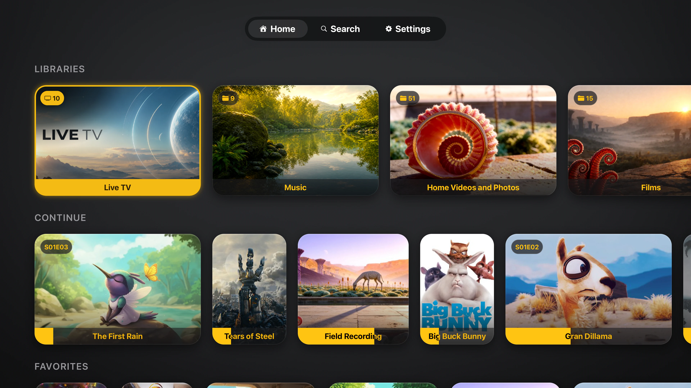

# Tomo TV

[](LICENSE)

[](https://github.com/keiver/tomotv/actions/workflows/test-pr.yml)
[](https://apps.apple.com/us/app/tomo-tv/id6755077888)

A free, open source Jellyfin client for Apple TV, iPhone and iPad, built with
React Native (react-native-tvos) and Expo.

Everything plays in the system's own `AVPlayer`. The format work happens on the
device, in a native engine that ships its own FFmpeg, and the result is handed to
AVKit as HLS, so playback keeps the transport, AirPlay and Picture in Picture the
platform already provides. Your server sends bytes and little else.

On iPhone and iPad an item or a whole folder can be kept on the device and played
with no server in reach, positions included; they sync back when one is.

<p align="center">
  
</p>

## The playback engine

Every item takes one of three lanes, chosen before playback starts by `predictPlaybackLane()` in
[`services/localRemux.ts`](services/localRemux.ts):

| Lane                    | What happens                                       | Where                                            |
| ----------------------- | -------------------------------------------------- | ------------------------------------------------ |
| **Direct play**         | Container rewrapped, streams copied byte for byte  | `Remuxer.swift`                                  |
| **On-device transcode** | Software decode + VideoToolbox encode, still local | `VideoTranscoder.swift`, `AudioTranscoder.swift` |
| **Server**              | Jellyfin transcodes; the fallback, not the default | `services/jellyfin/streamUrls.ts`                |

The engine runs a loopback HTTP server (`LocalHTTPServer.swift`) and serves
AVPlayer an HLS playlist it generates itself, so AVKit does the buffering, the
ABR switching and the rendering. The app never reimplements a player.

**Video.** Direct play is `REMUXABLE_CODECS` in
[`constants/codecs.ts`](constants/codecs.ts), H.264 and HEVC, plus AV1 wherever
the device reports hardware decode for it. Everything in
`TRANSCODABLE_VIDEO_CODECS`, AV1 included where it does not, is decoded in
software and re-encoded on device: H.264 for 8-bit sources, HEVC
Main 10 for 10-bit, with motion-adaptive deinterlacing on the way through. The
only gate is resolution: `TRANSCODE_MAX_PIXELS` is 2,100,000, which admits
1080p and excludes 4K, measured at 7.63x realtime on an Apple TV at 1.76 Mpx.

**Dolby Vision.** Profile 8.1 and 8.4 ride a stream copy: `SUPPLEMENTAL-CODECS`
is declared beside an untouched `hvc1` CODECS, and the mp4 muxer runs at
`FF_COMPLIANCE_UNOFFICIAL`, without which it drops the `dvcC`/`dvvC` box and the
file plays as plain HDR10 (`movenc.c:2978`). Profile 7 is dual layer, which Apple
decodes nowhere, so `DolbyVisionConverter.swift` rewrites each RPU to single-layer
8.1 as the copy runs and drops the enhancement layer. The base layer is untouched,
so it costs what a stream copy costs. An RPU it cannot convert fails the session to
the server rather than serving a stream its own manifest contradicts.

**Audio.** AAC, ALAC, AC-3, E-AC-3 and well-formed FLAC are copied, so Dolby
Atmos rides through untouched as JOC side data inside E-AC-3. Everything else
(TrueHD, DTS-HD, PCM, Opus, WavPack, Monkey's Audio and the rest) is decoded and
re-wrapped as FLAC, which is what lets AVPlayer play formats it cannot decode.
7.1 and 6.1 keep every channel; 24-bit stays 24-bit.

**Subtitles.** Text tracks ship as selectable HLS renditions. Image subtitles
(PGS, VobSub, DVB, XSUB) are decoded to timed bitmaps by
`ImageSubtitleDecoder.swift` and drawn over the native player, so a disc rip
keeps its stream-copied video.

### FFmpeg is built here, not vendored

`scripts/ffmpeg/build.sh` compiles FFmpeg with every native decoder enabled,
**497 of them**, from versions pinned in `scripts/ffmpeg/sources.sh`, published
by `.github/workflows/build-ffmpeg.yml` and fetched by `scripts/fetch-ffmpeg.js`
on `postinstall`. That is why DivX 3, Theora, DV, Cinepak, RealVideo and VVC play
on device rather than falling to the server.

```bash
npm run probe:codecs   # walks av_codec_iterate, prints what the build registers
```

Never infer decoder support from symbols: the static archives carry object files
for codecs that were never enabled. The allowlists in `services/localRemux.ts`
are keyed to **ffprobe's** names, which differ from the decoder's for a few:
DivX 3 decodes through `msmpeg4` but reports `msmpeg4v3`.

### Adaptive quality

`Auto` is the default and index 5 in `QUALITY_PRESETS`
([`services/jellyfin/constants.ts`](services/jellyfin/constants.ts)). The link to
each server is measured, remembered per server and re-warmed at launch
(`services/jellyfin/bitrateTest.ts`). `pickStartupIndex()` then opens on the
**highest** rung that reading carries at 0.7 trust, Original outright when the
link covers the source bitrate, and the 480p floor only when there is no reading
yet.

Explicit picks (0–4) are pinned ceilings. Note that **direct play and the
on-device engine ignore quality mode entirely**: the preset governs the server
lane only.

**Slipstream.** The engine lane is not blind to the link, though. Its loopback
master is multi-variant: the stream-copied original plus a 1.5 Mbps server-fed
rung, declared only when the measurement says the link cannot carry the file
(`slipstreamEligible()` and `SLIPSTREAM_TIER` in
[`services/localRemux.ts`](services/localRemux.ts)). AVPlayer switches between
them itself on the shared segment grid, so adapting costs no reload. The tier is
video-only and audio rides a shared rendition group (codecs AVPlayer decodes are
stream-copied by the server, everything else becomes FLAC), so the picture steps
down and the sound does not.

## Getting started

**Prerequisites:** Jellyfin Server 10.11, the release the app is developed and
tested against (transcoding optional), Node.js 18+,
Xcode 15+, CocoaPods (`npm install` installs it through Homebrew when missing).

```bash
git clone https://github.com/keiver/tomotv.git
cd tomotv
npm install            # postinstall patches deps and fetches the FFmpeg xcframeworks
npm run prebuild:tv    # regenerate the native project (deletes ios/)
npm run ios            # build and run on the tvOS simulator
```

Then open **Settings → Scan Network**. Tomo TV sweeps the local subnet honoring
the device's real netmask, so there is no address to type; manual entry accepts
reverse-proxy subpaths like `10.0.0.5/jellyfin`. Authorize with Quick Connect or
a password, add as many servers as you want, or use Jellyfin's public demo. A
failed connection lists every address tried and how each one failed.

## Development

```bash
npm start            # dev server
npm run logs         # stream native logs from the booted simulator
npm run ios          # build and run
npm test             # unit tests
npm run lint         # eslint + prettier
npm run prebuild:tv  # regenerate native projects (deletes ios/)
```

**Native logs.** Metro shows JavaScript only. `npm run logs` streams the booted
simulator's unified log (NSLog/os_log from the native modules, Apple framework
noise filtered). Run it in a pane beside `npm start`. Simulator only; physical
devices use Xcode's console.

**Patched dependency.** `react-native-video` carries a local patch applied by
`postinstall` via [patch-package](https://github.com/ds300/patch-package). It
adds the tvOS AVKit surfaces (`contentProposal`, `contextualActions`,
`infoPanelItems`, `unobscuredContentGuide` geometry) and fixes two upstream bugs:
React children of `<Video>` never reached `contentOverlayView`, and the tvOS
Picture in Picture restore handler was compiled out. Image subtitles, multi-audio,
Up Next and Skip Intro all depend on it.

The version range stays open on purpose. `postinstall` runs with
`--error-on-fail`, so an upgrade that breaks the patch fails the install rather
than quietly dropping those features. To edit it, change files under
`node_modules/react-native-video/` and run `npx patch-package react-native-video`.
`npm test` mocks the library, so none of this is covered, so changes need
`npm run prebuild:tv` and a device run.

**Releasing.** Archiving, signing and uploading to App Store Connect are
maintainer steps and live in [`docs/RELEASING.md`](docs/RELEASING.md).

## Architecture

```
app/                    expo-router screens (tabs, player, video-info, downloads, licenses)
components/             UI, including settings rows and the shelf/grid primitives
services/
  localRemux.ts         lane prediction, codec allowlists, engine session control
  downloads/            offline store: manifest, paths, transfer manager, local source
  adaptiveQuality.ts    rung selection and startup index
  jellyfin/             API client, split by concern (auth, items, streamUrls, …)
  audioQueuePlayer.ts   music/audiobook queue bridge
hooks/useVideoPlayback  the playback state machine
native/ios/
  LocalRemuxer/         the engine: remux, transcode, loopback server, subtitles, Dolby Vision
  Package.swift         host-side SwiftPM package for the engine tests
  AudioQueuePlayer/     native queue player, Now Playing, tvOS Up Next panel
  MultiAudioResourceLoader/   HLS manifest generation, seamless audio switching
  TopShelf/             tvOS Top Shelf extension
constants/codecs.ts     direct-play registry, shared by JS and the engine
test/playback/          the playback regression matrix (see below)
```

**Native code lives in `native/`.** The `ios/` and `tvos/` folders are generated
by prebuild and any direct edit there is lost.

**tvOS search renders the app's own grid.** `expo-tvos-search` supplies the native
`.searchable` field and its on-screen keyboard; the results area below is a React
Native child, so search draws the same packed rows as the Library tab
(`components/search-results-grid.tsx`) rather than a second set of cards.

## Testing

```bash
npm test                # jest: unit and integration, native modules mocked
npm run test:engine     # the engine's Swift, on the Mac, no simulator
npm run test:playback   # the real thing, on a simulator
```

`test:engine` builds `native/ios/Package.swift` against the same sources the app
compiles and runs them in seconds: Dolby Vision RPU conversion against committed
fixtures, the master playlist rules, the segment grid, and a codec matrix that
measures coverage rather than claiming it. The codec matrices need a host `ffmpeg`
to generate their fixtures and skip without one.

The playback suite is the one that matters for engine work. It deep-links into
the player against a real Jellyfin server with the real engine, across **71
manifest items**, and catches three regression classes unit tests cannot:

1. **Wrong lane.** A `localRemux` item silently falling back to server transcode
   fails, even though playback looks fine on screen.
2. **Broken playback.** Position must advance past `progressMin` with no error
   events.
3. **Changed output.** The engine's loopback HLS is hashed by host ffmpeg against
   committed baselines. Stream-copied video compares exact packet hashes, which
   embed PTS, so timeline and subtitle-sync shifts show up as diffs.

Only regenerate baselines from a build you trust (`-- --update-baselines`). See
[`test/playback/README.md`](test/playback/README.md).

## Contributing

Fork, branch from `main`, follow the existing patterns, add tests, and run
`npm test` and `npm run lint` before opening a PR.

**Code standards:** strict TypeScript (no unjustified `any`), try-catch around
async work, proper React cleanup, and border-only focus feedback (no scale
animations on grid items).

If you touch the engine or the codec allowlists, run `npm run test:playback` and
say so in the PR. Unit tests mock the native modules and will not catch a lane
regression.

## Known limitations

- **Codecs.** H.264 and HEVC direct play from any container, as does AV1 where
  the hardware decodes it; everything else converts on device, including 10-bit,
  interlaced and audio-only sources. The server only transcodes what exceeds the
  device's throughput budget.
- **Platform.** tvOS, iOS and iPadOS. The iPad build also installs on Apple
  silicon Macs and Vision Pro, where it runs as the iPad app. No Android.
- **Downloads.** iPhone and iPad only. Apple gives a tvOS app no persistent local
  storage, so there is nothing to keep files in and the tab does not exist there.
- **Server.** Jellyfin only. Not compatible with Plex, Emby or others.
- **Network.** HTTP is permitted on all networks via `NSAllowsArbitraryLoads`.
  HTTPS is strongly recommended for anything outside your LAN.

## A Note on AI

I use Claude as a development tool for drafting code and documentation.
Architecture and decisions are mine. Blame me for any shady code.

## License

MIT. See [LICENSE](LICENSE).

The shipped media stack is third-party and separately licensed: FFmpeg
(LGPL 3.0), Mbed TLS, dav1d, uavs3d, libass, FreeType, HarfBuzz and GNU FriBidi.
Full texts and per-component copyright are in the app under
**Settings → Open Source**, generated from
[`constants/licenses.ts`](constants/licenses.ts).

## Acknowledgments

- **Jellyfin Team** for the open source media server
- **Expo** and **react-native-tvos** for Apple TV support
- **Blender Foundation** for open movie test files (Sintel, Elephants Dream, Caminandes)
- **IETF** for Matroska test files used in development

## Links

- **Site:** [tomotv.app](https://tomotv.app/)
- **Support:** <contact@keiver.dev>
- **expo-tvos-search:** [github.com/keiver/expo-tvos-search](https://github.com/keiver/expo-tvos-search)
