# Tomo TV - Jellyfin Client for Apple TV

[](LICENSE)
[](https://apps.apple.com/us/app/tomo-tv/id6755077888)
[](package.json)
[](https://apps.apple.com/us/app/tomo-tv/id6755077888)

A free and open source Jellyfin client for Apple TV. Stream any video from your server, switch audio
tracks mid-playback, and let codec handling sort itself out. Just press play.

<p align="center">
  
</p>

<table>
  <tr>
    <td align="center">
      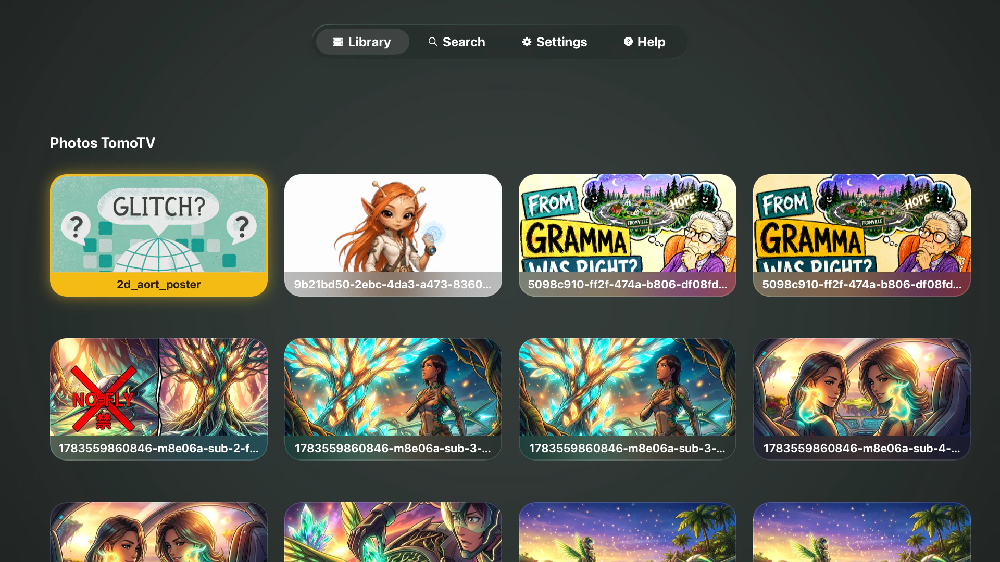<br/>
      <sub>Photos</sub>
    </td>
    <td align="center">
      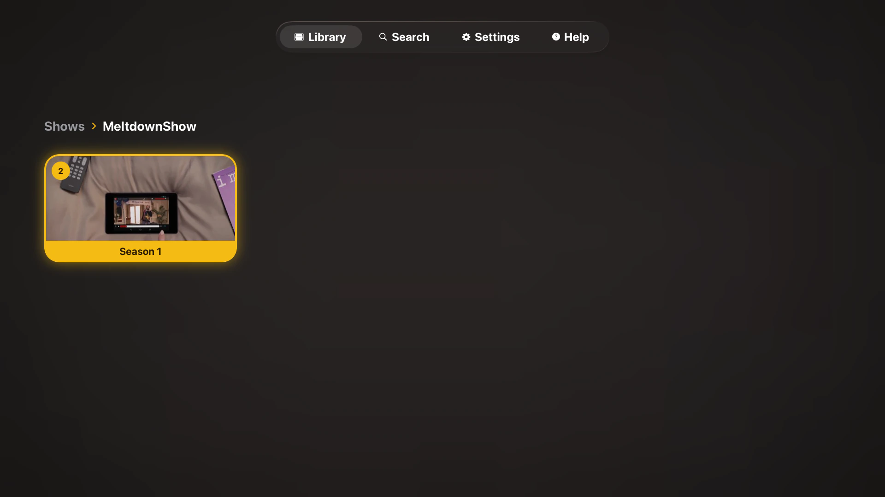<br/>
      <sub>Shows</sub>
    </td>
   <td align="center">
      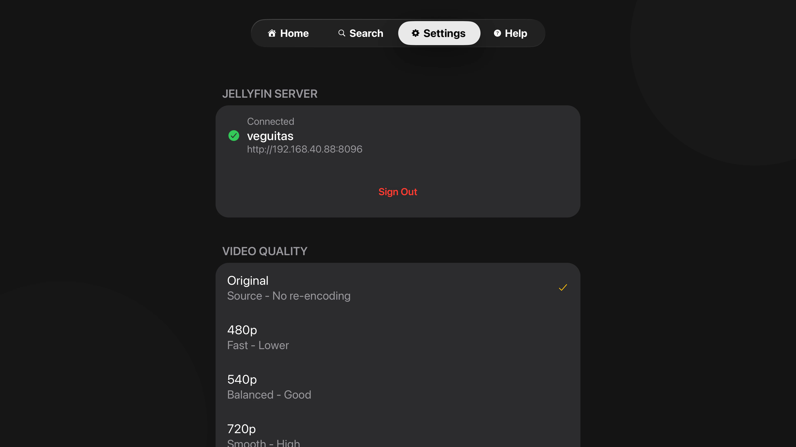<br/>
      <sub>Connected</sub>
    </td>
  </tr>
  <tr>
    <td align="center">
      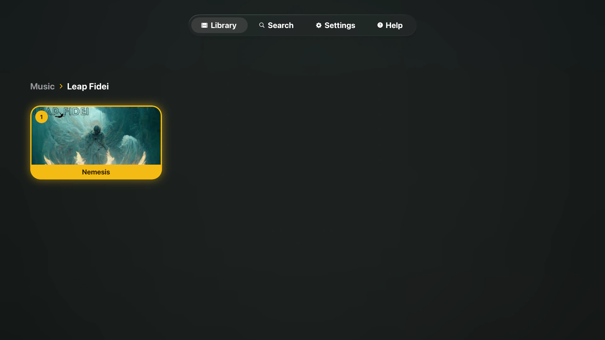<br/>
      <sub>Music</sub>
    </td>
    <td align="center">
      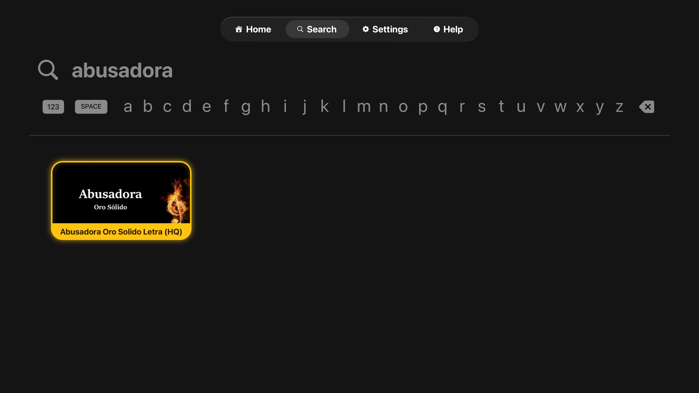<br/>
      <sub>Native search</sub>
    </td>
    <td align="center">
      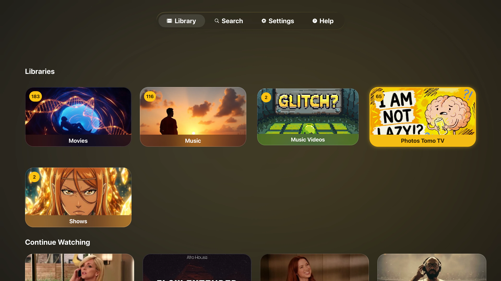<br/>
      <sub>Libraries</sub>
    </td>
  </tr>
  <tr>
    <td align="center">
      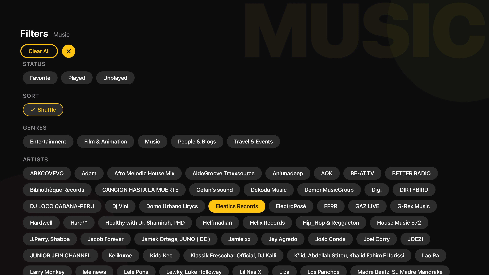<br/>
      <sub>Filters</sub>
    </td>
    <td align="center">
      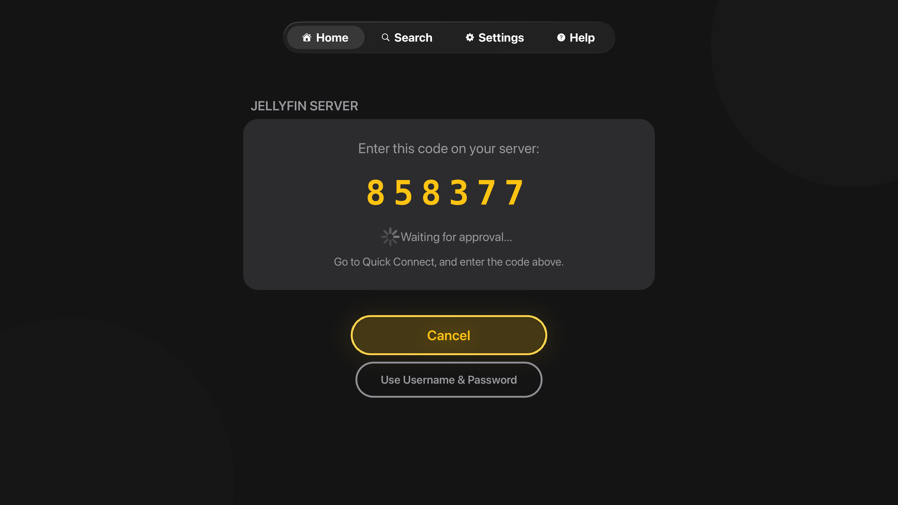<br/>
      <sub>Quick Connect</sub>
    </td>
    <td align="center">
      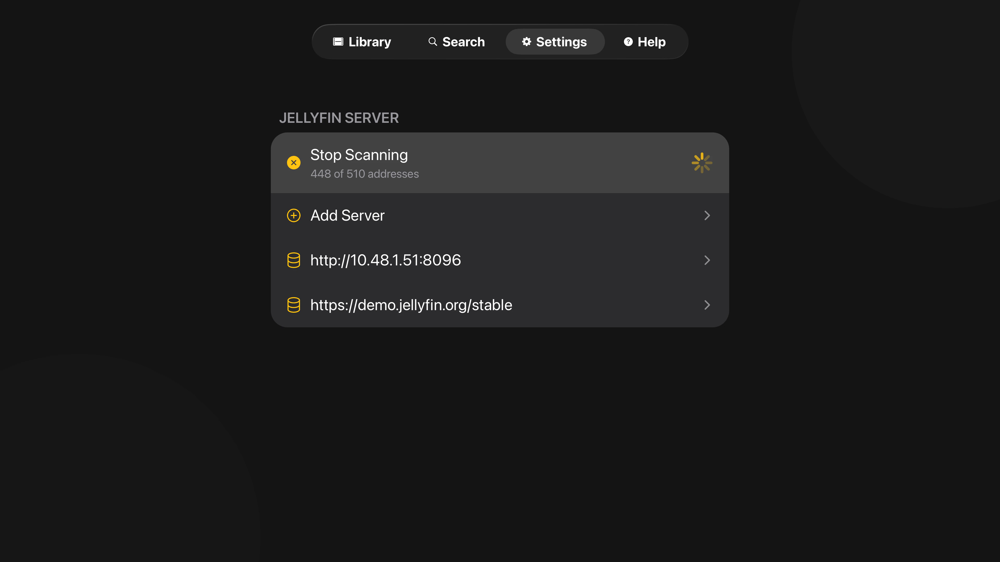<br/>
      <sub>Network scan</sub>
    </td>
  </tr>
</table>

## Why TomoTV

Built from the ground up for Apple TV with a focus on seamless playback. Switch
audio tracks mid-video without restarting, thanks to custom HLS manifest
generation in a native Swift module. Codec compatibility is handled
automatically, so you spend time watching instead of troubleshooting.

## Features

- **Smart streaming.** An on-device engine plays H.264 and HEVC from any container and converts legacy codecs (VP8/VP9, MPEG-1/2/4, WMV, VC-1, and more) locally. The server only transcodes true edge cases.
- **Multi-audio tracks.** Change the audio track mid-playback without restarting, using custom multivariant HLS manifests.
- **Subtitle support.** External (.srt) and embedded tracks through the native tvOS picker. Image subtitles (PGS, DVDSUB) and forced tracks burn in during transcoding.
- **Native search.** SwiftUI-powered, with proper tvOS focus navigation. Find by title, season, or year.
- **Up next queue.** Auto-advances through seasons and playlists.
- **Continue watching.** Resume from your last position.
- **Library filters.** Filter any library by favorites, genre, artist, or year. Shuffle plays the whole filtered set in a fresh random order.
- **Favorites.** Long-press a card to favorite it. Favorited items wear a gold heart while browsing.
- **Photo viewer.** Photo libraries and albums with a full-screen viewer and slideshow.
- **Scan the network.** Sweeps the local subnet for Jellyfin servers, honoring the device's real netmask, so there is no address to type.
- **Folder browsing.** Walk your library by folders, collections, seasons, and playlists.
- **Demo mode.** Try it instantly against Jellyfin's public demo server.
- **Secure by default.** Credentials stored in the device Keychain.

<p align="center">
  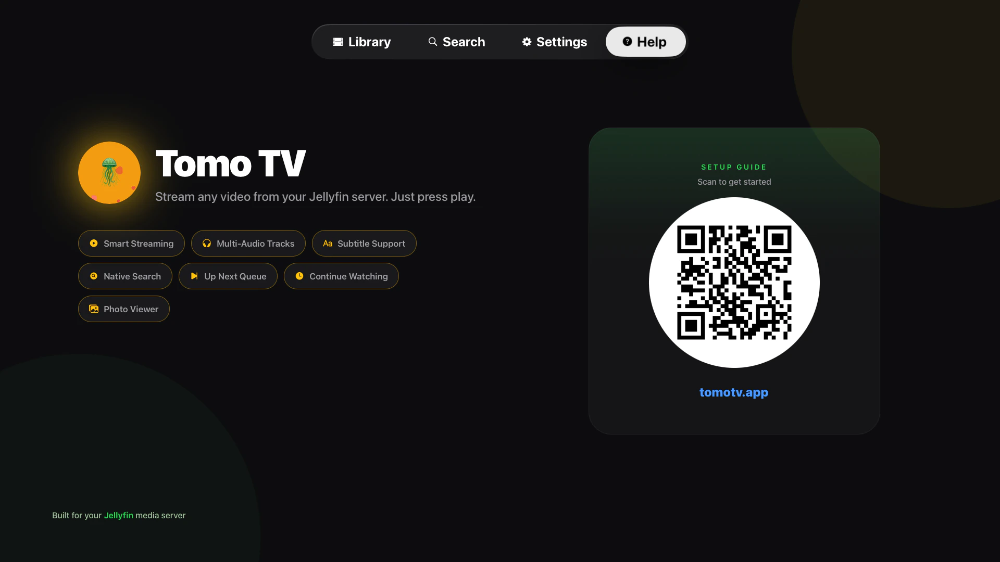
</p>

## Installation

### Prerequisites

- **Jellyfin Server 10.8+** with transcoding enabled
- **Node.js 18+**
- **Xcode 15+**

### Setup

```bash
# Clone the repository
git clone https://github.com/keiver/tomotv.git
cd tomotv

# Install dependencies
npm install

# Prebuild for tvOS
npm run prebuild:tv

# Run on tvOS simulator
npm run ios

# Or build for an Apple TV device
npx expo run:ios
```

### Connect to your server

Open **Settings** and pick **Scan Network**: Tomo TV sweeps your local subnet
(honoring the device's real netmask, so a /23 is covered end to end) and lists
every Jellyfin server it finds, with no address to type. You can still add a
server manually by IP or full URL, including reverse-proxy subpaths like
`10.0.0.5/jellyfin`. Authorize with a Quick Connect code or username and
password. Add as many servers as you like and switch between them, including
Jellyfin's public demo.

The connect screen shows this device's own IP, warns when a private address is
not on this subnet, and a failed connection lists every address that was tried
and how each one failed, instead of one generic message.

<p align="center">
  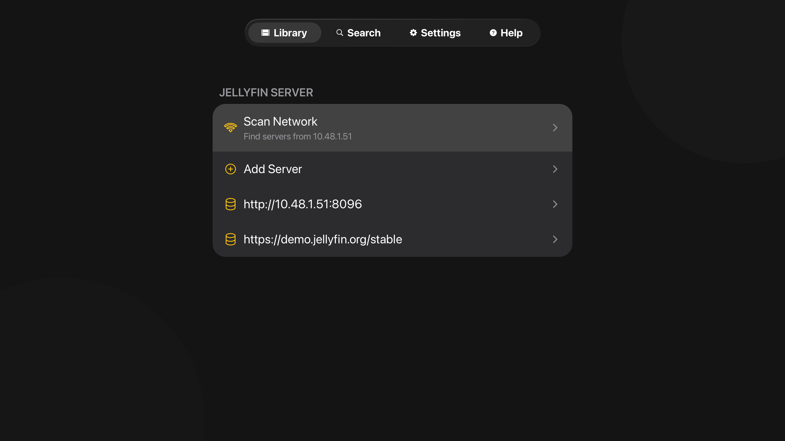
</p>

### Video quality

Tomo TV supports Original (untouched quality, the default), 480p, 540p, 720p,
1080p, and 4K presets. Configure under **Settings → Video Quality**.

### Network requirements

- **All networks:** HTTP and HTTPS are allowed via `NSAllowsArbitraryLoads`.
- **Remote servers:** HTTPS is strongly recommended. HTTP exposes credentials in plaintext.

## Development

```bash
npm start            # Start dev server
npm run ios          # Build and run
npm test             # Run tests
npm run lint         # Lint and auto-fix
npm run prebuild:tv  # Rebuild native projects (deletes ios/ folder)
```

**Native code:** Always edit files in the `native/` folder. The `ios/` folder
is regenerated by prebuild, and any direct edits there are lost.

## A Note on AI

I use Claude as a development tool for drafting code and documentation.
Architecture and decisions are mine. Blame me for any shady code.

## Contributing

Contributions are welcome. Fork the repo, branch from `main`, follow the
existing patterns, add tests for new functionality, and run `npm test` and
`npm run lint` before opening a PR.

**Code standards:** strict TypeScript (no unjustified `any`), try-catch around
async work, proper React cleanup, and border-only focus feedback (no scale
animations on grid items).

## Known Limitations

- **Codec support:** H.264 and HEVC direct play from any container. Most legacy codecs transcode on the device (up to 1080p, 8-bit, progressive). The server handles the rest: 4K exotic codecs, 10-bit, interlaced sources, and subtitle burn-in.
- **Platform:** tvOS and iOS (iPhone/iPad). Android is not supported for now.
- **Network:** HTTP is allowed on all networks. HTTPS is recommended for remote servers.
- **Server:** Jellyfin only. Not compatible with Plex, Emby, or others.

## License

MIT License. See [LICENSE](LICENSE) for details.

## Acknowledgments

- **Jellyfin Team** for the open-source media server
- **Expo Team** for React Native TVOS support
- **Blender Foundation** for open movie test files (Sintel, Elephants Dream, Caminandes)
- **IETF** for Matroska test files used in development

## Links

- **Documentation:** [tomotv.app](https://tomotv.app/)
- **Support:** <contact@keiver.dev>
- **Demo server:** Jellyfin's official demo at demo.jellyfin.org
- **expo-tvos-search:** [github.com/keiver/expo-tvos-search](https://github.com/keiver/expo-tvos-search)
