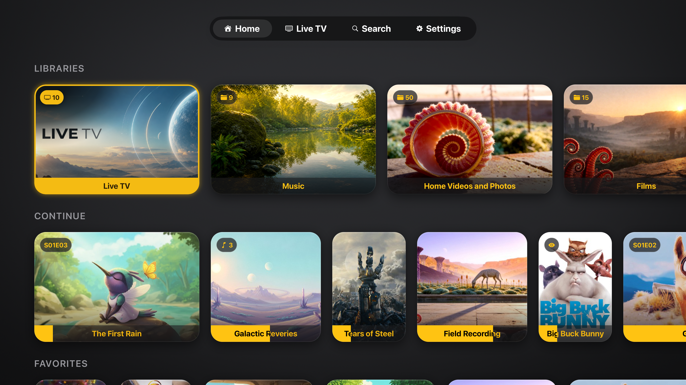

# Tomo TV

[](LICENSE)

[](https://github.com/keiver/tomotv/actions/workflows/test-pr.yml)
[](https://apps.apple.com/us/app/tomo-tv/id6755077888)
[](https://www.npmjs.com/package/@keiver/tomo-engine)
[](https://www.npmjs.com/package/@keiver/tomo-live)

A free, open source Jellyfin client for Apple TV, iPhone, iPad and Mac. Files play at
original quality in Apple's own player, with an on-device FFmpeg engine doing the
format work the server would otherwise transcode: MKV and AVI, Dolby Vision,
Dolby Atmos, PGS subtitles and Live TV. Built with React Native (react-native-tvos)
and Expo.

<p align="center">
  
</p>

## How playback works

Every file plays in the system's `AVPlayer`, so the transport, AirPlay and
Picture in Picture are Apple's own. A file AVPlayer can open plays straight from
the server. For everything else, an engine on the device reads the original file,
does the format work with its own FFmpeg build, and hands AVPlayer an HLS stream
it serves on loopback. It reads an original from the server over three ranged
connections at once when the server answers range requests.

```
Jellyfin server
    |  the original file
    v
Engine on the device        @keiver/tomo-engine, with its own FFmpeg
    |  copies the streams, or decodes and re-encodes through VideoToolbox
    |  decodes subtitles, rewrites Dolby Vision profile 7 to 8.1
    v
HLS on loopback             a playlist and segments the engine writes
    |
    v
AVPlayer / AVKit            the platform's player, transport, AirPlay, PiP
```

Each session starts in one of four lanes:

| Lane                    | What happens                                       |
| ----------------------- | -------------------------------------------------- |
| **Direct play**         | AVPlayer reads the file from the server as it is   |
| **On-device copy**      | Container rewrapped, streams copied byte for byte  |
| **On-device transcode** | Software decode + VideoToolbox encode, still local |
| **Server**              | Jellyfin transcodes; the fallback, not the default |

The lane is measured on the device, not assumed. H.264 and HEVC are copied only
when this device's VideoToolbox opens them in hardware at the file's own size
and the picture is progressive; interlaced sources are deinterlaced on device
rather than copied, and everything else is re-encoded locally, like every other
codec the engine accepts. If on-device conversion cannot keep up, playback
falls back to the server. Two such measurements on the same app build keep that file on the
server for 30 minutes.

When the server may be asked at all is a setting, Settings > Server
transcoding: **When needed** (the default) for files the device cannot play and
smaller streams on a slow connection, **Only for unsupported files**, where a
slow connection waits on the original, or **Off**. The account's own transcoding
permission on the server overrides all three.

- **Dolby Vision.** Profiles 8.1 and 8.4 are copied as they are. Profile 7,
  which no Apple device decodes, is rewritten to single-layer 8.1 during the copy.
- **Audio.** AAC, ALAC, AC-3, E-AC-3 and FLAC are copied, so Dolby Atmos reaches
  the receiver untouched. TrueHD, DTS-HD, PCM, MP3, Opus and the rest are decoded
  to lossless FLAC, up to 7.1. Switching audio tracks does not restart playback.
- **Subtitles** never send a file to the server's transcoder. Embedded text
  tracks become WebVTT on the device, sidecar text files arrive as the server's
  WebVTT and sidecar image files as they are, and image tracks (PGS, VobSub,
  DVB, XSUB) are decoded to bitmaps drawn over the native player.
- **Scrubbing.** A video scrubs on its own keyframes: Apple TV shows them
  as thumbnails over the timeline, iPhone and iPad as the picture itself. A file
  played as it is gets them from the system; the engine and the server stream
  get them from the original file, read only when the player asks. A picture
  larger than 1080p is scaled to 1080p and an HDR picture is converted to
  standard range first. A Dolby Vision profile 5 file the engine or server
  plays, and a server stream of a codec the engine does not decode, have none.
- **Quality.** Auto plays the original alone when the connection can carry it,
  and the server transcodes nothing. On a slower connection the playlist adds
  smaller server streams (stereo AAC), if the account is allowed to transcode
  and Server transcoding is at When needed, and AVPlayer switches between them
  and the original without a restart. A fixed preset applies only when the server has to transcode. The connection is timed on
  real files: the engine reads the one playing, and Settings reads ten seconds of
  one in the library.
- **Live TV** uses the same engine. HLS and DASH origins are read directly, tuner
  streams are read from their source when the device can reach it, otherwise
  through the server untouched, and the server's live transcode is the fallback.
- **FFmpeg** is built in this repo from pinned sources, with every native decoder
  enabled, published by CI and fetched when `@keiver/tomo-engine` installs. DivX 3,
  RealVideo, Theora, DV and Cinepak all play on the device; the measured list is in
  [`docs/playback-coverage.md`](docs/playback-coverage.md).

## Features

- **Live TV.** A guide by time and channel, a wall of every channel with live
  previews, and Recordings with filters. The guide opens on today or any of the
  13 days after it, and search finds programmes through tomorrow by name,
  episode title or description, in the server's guide and your guide sources.
  Accounts allowed to manage recordings also get the schedule and record
  controls. Hold a channel for its info panel, to record, favorite or group it. On Apple TV, the remote's channel-skip
  gesture flips channels, and for 30 seconds after a flip the channels on either
  side keep running.
- **Themes.** Tomo, Green, Blue, Purple or a colour of your own, in Settings >
  Appearance. Saved themes live in your Jellyfin user's display preferences, so
  each device signed in as you lists them, and each device keeps its own pick.
  Background sets what sits behind the screens: Folder artwork (the default),
  Theme color or Clear.
- **Info panels** on iPhone, iPad and Mac drag sideways to the next item: an
  episode across seasons, a song on its album, the photo, book or folder beside
  it, the next library or channel.
- **Books.** PDF, comics (CBZ, CBR, CBT, CB7), EPUB, MOBI and Kindle AZW/AZW3 in a
  full-screen reader, with the reading position saved to the server.
- **Downloads** on iPhone, iPad and Mac: an item or a whole folder, playable with no
  server in reach, with watch positions synced back later. Keep the original, or
  a smaller copy at 1080p, 720p or 480p that the server converts on the way down,
  in your audio language with the subtitle you would see. An original of 64 MB
  or more comes down as up to four ranged parts, three at a time, where the
  server answers range requests.
- **SyncPlay**, Jellyfin's watch-together. The Apple TV shows a join code; a
  phone signed in to the same server scans it with the camera to join.
- **Apple TV.** Skip Intro, Skip Credits and Skip Commercial from Jellyfin's
  Media Segments, chapter thumbnails, the Up Next panel, and Continue Watching
  with recently played channels on the Top Shelf. iPhone and iPad skip
  commercials on their own.
- **Music** keeps playing while you browse, with Now Playing controls.
- **Diagnostics.** The last playback as a versioned JSON document
  ([schema](docs/diagnostics-session.schema.json)): the lane, why the engine
  chose it, the streams, every error, and what the device decodes in hardware.
  The error screen shows an error ID (cause, lane, native code, build) that the
  document records too.
  Share it from the phone, or send it from the Apple TV to your phone through
  your own account on the server. Nothing goes anywhere else.
- **Languages.** English, German, French and Spanish, following the device or
  picked in Settings.

## The packages

The engine and the live TV services are npm packages developed here, usable by
any Expo app on Apple TV, iOS or Mac Catalyst. Neither knows Jellyfin: Tomo connects them in
`services/localRemux.ts` and `services/liveChannels.ts`.

| Package                                       | Holds                                                                                                     |
| --------------------------------------------- | --------------------------------------------------------------------------------------------------------- |
| [`@keiver/tomo-engine`](packages/tomo-engine) | The engine, native XMLTV and M3U parsing, frame grabs, probes, and the pinned FFmpeg build                |
| [`@keiver/tomo-live`](packages/tomo-live)     | Warm neighbour channels, focus previews, live frames and clips, channel health, guide sources, `LiveClip` |

Here they are npm workspaces, so Tomo builds against the source in the same
commit. A commit that changes a published package gets a patch bump from the
pre-commit hook, Test PR fails a package change without a new version, and a
merge to `main` publishes it (`.github/workflows/publish-packages.yml`).

## Getting started

You need a Jellyfin server (10.10 or later for Skip Intro), Node.js 18 or later,
and Xcode 26 or later. CocoaPods is installed through Homebrew if missing.

```bash
git clone https://github.com/keiver/tomotv.git
cd tomotv
npm install            # links the packages, fetches the FFmpeg frameworks, applies patches, regenerates licenses
npm run clear         # prepares iOS, Mac, then tvOS; opens Xcode and starts Metro
```

In the root `TomoTV.xcworkspace`, choose the scheme for your device:

| Scheme         | Destination                                |
| -------------- | ------------------------------------------ |
| `TomoTV-iOS`   | iPhone or iPad                             |
| `TomoTV-macOS` | My Mac (Mac Catalyst), macOS 13.4 or later |
| `TomoTV-tvOS`  | Apple TV                                   |

Build and run from Xcode. The Mac app supports Apple Silicon and Intel. For Mac
alone, use `npm run clearmac`. To prepare the projects without opening Xcode or
starting Metro, use `npm run prebuild:all` or `npm run prebuild:mac`.
The scripts detect a missing Metal Toolchain and offer to install it after
approval. Signing and local FFmpeg setup are covered in
[the release guide](docs/RELEASING.md#mac-setup-and-local-validation).

In the app, open **Settings → Scan Network** to find servers on your network, or
type an address; reverse-proxy paths work. Sign in with Quick Connect or a
password. Submitting the empty Add Server field connects to Jellyfin's public
demo.

## Development

```bash
npm start               # Metro dev server
npm run logs            # native logs from the booted simulator
npm run lint            # eslint + prettier
npm test                # jest unit and integration tests, the packages' JS included
npm run test:engine     # the engine's Swift tests, on the Mac
npm run test:playback   # the playback suite, against a real server
npm run test:release    # project generation, signing hooks and store workflow checks
```

Native code lives in `packages/*/ios` and `native/`; `plugins/` and `scripts/`
configure the projects. The `ios/`, `macos/` and `tvos/` folders are generated by
prebuild, and edits there are lost.

```
app/                    expo-router screens
components/             UI
hooks/useVideoPlayback  the playback state machine
services/
  localRemux.ts         lane choice and the Jellyfin item to engine session mapping
  liveChannels.ts       Tomo's channels as @keiver/tomo-live reads them
  jellyfin/             API client, split by concern
  syncPlayManager.ts    SyncPlay groups and command scheduling
  downloads/            offline store
  books/                book formats and reading position
  i18n/                 strings: en, de, fr, es
packages/
  tomo-engine/          @keiver/tomo-engine
    ios/LocalRemuxer/   the engine: remux, transcode, loopback server, subtitles, Dolby Vision, live
    ios/LiveSources/    XMLTV guides and M3U playlists, loaded and parsed natively
    src/                the typed JS API over both native modules
    Package.swift       SwiftPM package for the engine tests
  tomo-live/            @keiver/tomo-live
    src/                ring, previews, frames, channel health, guide sources
    ios/                the LiveClip Expo module
native/ios/
  TunerGroups/          a Jellyfin tuner's groups and channel ids, over the engine's playlist loader
  MultiAudioResourceLoader/   HLS manifests, audio track switching
  AudioQueuePlayer/     music queue, Now Playing, tvOS Up Next panel
  BookRenderer/         PDF, comic, EPUB and MOBI pages
  TopShelf/             tvOS Top Shelf extension
  Package.swift         SwiftPM package for the book tests
modules/tomo-toast/     the in-app toast strip, an Expo module
constants/codecs.ts     the direct-play codec list
test/playback/          the playback regression suite
```

`test:engine` runs the engine on the Mac: Dolby Vision conversion against
committed fixtures, the playlist rules, and a codec matrix that records which
codecs are proven by a fixture.

`test:playback` deep-links the app into the player against a real Jellyfin server,
across 83 items (78 files and 5 Live TV channels). It catches what unit tests
cannot: an item taking the wrong lane, playback that does not advance, and engine
output that drifts from the committed baselines. If you touch the engine or its
allowlists, run it and say so in the PR. See
[`test/playback/README.md`](test/playback/README.md).

`react-native-video` carries a local patch, applied on `npm install`, for the tvOS
AVKit features (Up Next, the info panel, chapters, channel flipping) and upstream
fixes. An upgrade that breaks the patch fails the install instead of silently
dropping them. To change it, edit `node_modules/react-native-video/` and run
`npx patch-package react-native-video`.

Releasing the app is a maintainer step: [`docs/RELEASING.md`](docs/RELEASING.md).
`npm run archive -- <next-build>` archives iOS, Mac and tvOS in that order with
one increasing build number. Mac screenshots are captured manually into
`applestore/captures/mac/`; `npm run shots -- --render` composes the store images.

## Contributing

Fork, branch from `main`, follow the existing patterns, add tests, and run
`npm test` and `npm run lint` before opening a PR. Strict TypeScript, cleanup on
every effect, and no scale animations on grid items. Keep Jellyfin and Tomo out
of `packages/`: it ships to npm.

## Known limitations

- **Platforms.** tvOS, iOS, iPadOS, and Mac Catalyst on macOS 13.4 or later
  (Apple Silicon and Intel). No Android. `npm run clear` prepares all three
  Xcode schemes; `npm run clearmac` prepares just Mac. See
  [release setup](docs/RELEASING.md#mac-setup-and-local-validation) for signing and screenshots.
- **Downloads** are available on iPhone, iPad and Mac: tvOS gives apps no persistent storage.
- **Server.** Jellyfin only.
- **Network.** HTTP is allowed on every network. Use HTTPS beyond your LAN.

## Disclaimer

Tomo TV is a player. It hosts, distributes and ships no media, channels,
playlists or guides: it plays what your Jellyfin server and the sources you add
provide, and you are responsible for having the right to access them. It is
provided as is, without warranty, under the MIT License.

Tomo TV is an independent client, not affiliated with or endorsed by the
Jellyfin project. Jellyfin is a trademark of its respective owner. Apple, Apple
TV, iPhone, iPad and AirPlay are trademarks of Apple Inc. Dolby, Dolby Vision and
Dolby Atmos are trademarks of Dolby Laboratories Licensing Corporation. All other
marks belong to their owners.

The screenshot above shows Big Buck Bunny, © 2008 Blender Foundation |
bigbuckbunny.org, and Tears of Steel, (CC) Blender Foundation |
mango.blender.org, both under CC BY 3.0. Rights concerns go to
<contact@keiver.dev>.

## A Note on AI

I use Claude and other AI tools for drafting code and documentation.
Architecture and decisions are mine. Blame me for any shady code.

## License

MIT. See [LICENSE](LICENSE). Both packages are MIT as well.

The shipped media stack is third-party and separately licensed: FFmpeg
(LGPL 3.0), libzvbi (LGPL 2.0 or later), Mbed TLS, dav1d, uavs3d, libass,
FreeType, HarfBuzz, GNU FriBidi, libarchive, XZ Utils and foliate-js.
Full texts and per-component copyright are in the app under
**Settings → Open Source**, and the engine's in
[`packages/tomo-engine/NOTICE.md`](packages/tomo-engine/NOTICE.md).

## Acknowledgments

- **Jellyfin Team** for the open source media server
- **Expo** and **react-native-tvos** for Apple TV support
- **Blender Foundation** for open movie test files (Sintel, Cosmos Laundromat)
- The **Matroska test suite** for container test files used in development

## Links

- **Site:** [tomotv.app](https://tomotv.app/)
- **Support:** <contact@keiver.dev>
- **npm:** [@keiver/tomo-engine](https://www.npmjs.com/package/@keiver/tomo-engine), [@keiver/tomo-live](https://www.npmjs.com/package/@keiver/tomo-live)
- **expo-tvos-search:** [github.com/keiver/expo-tvos-search](https://github.com/keiver/expo-tvos-search)
